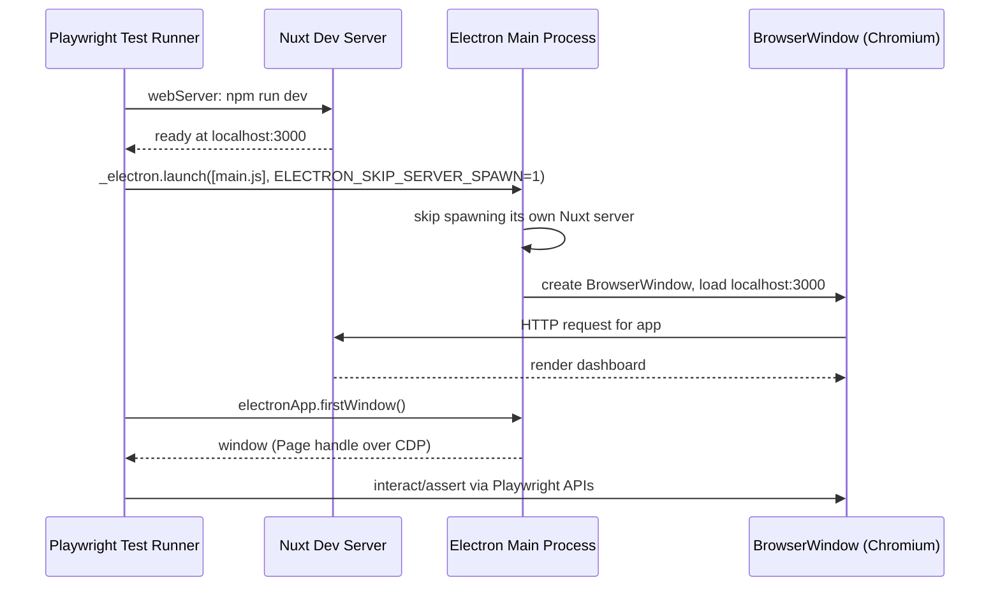

# Electron Playwright Test Suite

A Nuxt-based dashboard app packaged as an Electron desktop app, with an end-to-end test suite powered by Playwright's Electron support.

## Stack

- [Nuxt 4](https://nuxt.com/) + [Nuxt UI](https://ui.nuxt.com/) for the frontend
- [Electron](https://www.electronjs.org/) to run the app as a desktop application
- [Playwright](https://playwright.dev/) for end-to-end testing of the Electron app

## Getting Started

Install dependencies:

```bash
npm install
```

Run the app in development mode (Nuxt dev server):

```bash
npm run dev
```

Run the app as a desktop Electron app:

```bash
npm run build
npm run start
```

## Running Tests

The Playwright suite launches the Electron app directly (via [main.js](main.js)) and starts the Nuxt server automatically.

```bash
npm test
```

Test files live in [tests/](tests), with page objects under [tests/pages/](tests/pages).

### Fixtures

[tests/fixtures.ts](tests/fixtures.ts) extends Playwright's `test` with three fixtures that every spec uses instead of the built-in `page`:

- `electronApp` — launches Electron via `_electron.launch()` against the repo's [main.js](main.js), with `ELECTRON_SKIP_SERVER_SPAWN=1` so the app connects to the Nuxt dev server started by Playwright's `webServer` config rather than spawning its own.
- `window` — the app's first `BrowserWindow`, exposed as a normal Playwright `Page`.
- `homePage` — a `HomePage` page-object ([tests/pages/HomePage.ts](tests/pages/HomePage.ts)) wrapping `window` with locators/actions for the dashboard nav.

## Architecture


